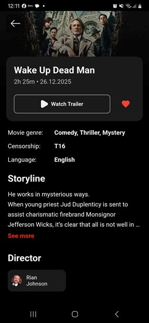
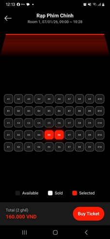
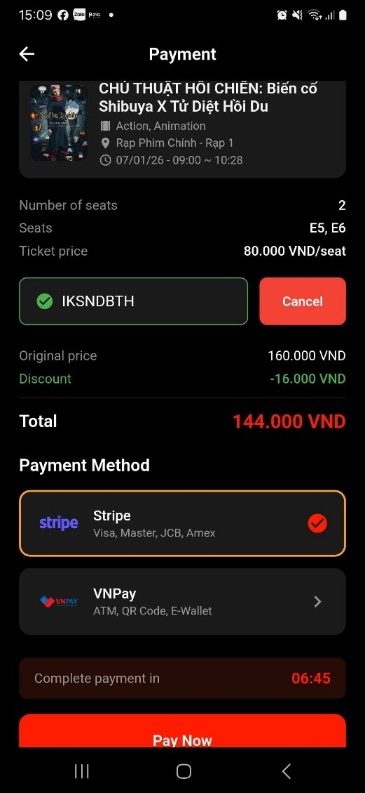
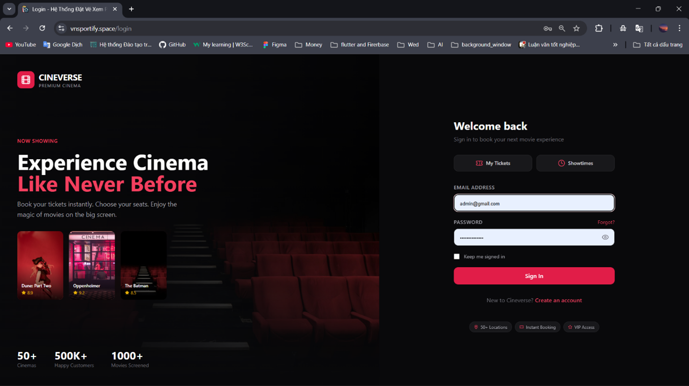
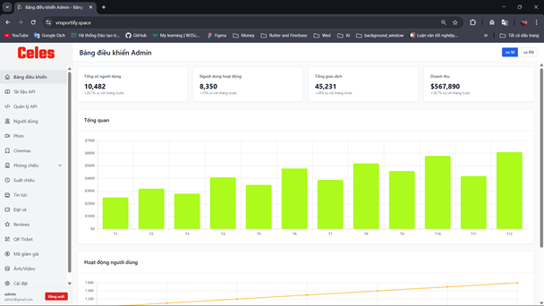

# Celes

Celes is a modern movie ticket booking application designed to simplify the cinema experience. Users can discover movies, browse cinema schedules, reserve seats, complete secure ticket purchases, and manage their bookings through an intuitive and responsive interface.

## Logo

<p align="center">
  
</p>

## Screenshots

### Mobile Application

<p align="center">
  
  
  
  
</p>

<p align="center">
  Home • Movie Detail • Select Seat • Payment
</p>

---

### Admin Dashboard (Web)

<p align="center">
  
</p>

<p align="center">
  
</p>

---> This repository contains the Flutter application only. The backend implementation is available in the [Celes Backend](https://github.com/LyHoTuanAn/LVTN_BE) repository.

## Ticket Booking Workflow

> 🔒 **Authentication Required**
>
> Users must sign in before proceeding with ticket booking.

| Stage | Description |
|--------|-------------|
| 1. Browse Movies | Explore currently showing and upcoming movies. |
| 2. Select Date & Cinema | Choose your preferred cinema and showtime. |
| 3. Seat Selection | Pick available seats from the seating layout. |
| 4. Payment | Complete the booking using the supported payment method. |
| 5. Confirmation | Receive your booking confirmation and e-ticket. |

## Tech Stack

**Client:** Flutter, Dart, Bloc (state, routing, DI), Dio (HTTP client)

**Services:** Firebase, Stripe

**Server:** PHP, Laravel

**Local Storage:** SharedPreferences, GetStorage, Hive

## Features

- Browse now showing and upcoming movies
- Search movies, cinemas, and showtimes
- View cinema details and available schedules
- Interactive seat selection with real-time availability
- Book movie tickets securely
- Online payment integration
- User authentication and profile management
- Booking history and e-ticket management
- Light/Dark mode support
- Cross-platform support (Android & iOS)

## Run Locally

###  System Requirements

- **Flutter SDK**: Stable channel, version `3.32.2`
- **Java**: Version `17`

---

### 🚀 Run the Application

```shell
flutter run
```


Update iOS Pods
```shell
cd ios
pod init
pod update
pod install
cd ..
```

Clean Pub Cache
```shell
flutter clean
flutter pub cache clean
flutter pub get
```

Repair Pub Cache
```shell
flutter clean
flutter pub cache repair
flutter pub get
```


Generate Android APK
```shell
flutter build apk --split-per-abi
open  build/app/outputs/flutter-apk/
```

## Contributor
- [Ly Trieu Duong](https://github.com/Duwong31) – Mobile Developer
- [Nguyen Quoc Tuan](https://github.com/NguyenTuan298) – Mobile Developer
- [Ly Trieu Duong](https://github.com/LyHoTuanAn) – Backend Developer
